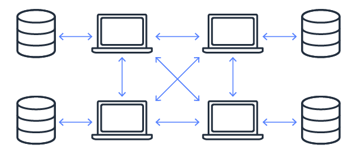

# 🔰 How does blockchain work?

#### <mark style="color:yellow;">How does blockchain work?</mark>&#x20;

Blockchain mechanisms are complex, so we will provide a fairly brief overview in the next steps. Blockchain software can automate most of these steps:

#### <mark style="color:yellow;">Step 1 - Record the transaction</mark>&#x20;

A blockchain transaction shows the movement of physical or digital assets from one party to another on the blockchain network. It is recorded as a block of data that includes details such as these:

* Who were the parties involved in the transaction?&#x20;
* What happened during the transaction?&#x20;
* When did the transaction occur?&#x20;
* Where did the transaction occur?&#x20;
* Why did the transaction occur?&#x20;
* How much of the asset was exchanged?&#x20;
* How many preconditions were fulfilled during the transaction?

#### <mark style="color:yellow;">Step 2 - Obtain consensus</mark>&#x20;

The majority of the participants in the distributed blockchain network need to agree that the recorded transaction is valid. Depending on the type of network, the rules of agreement may vary, but they are usually established at the start of the network.

<mark style="color:yellow;">**Step 3 - Linking the blocks**</mark>&#x20;

When the participants have reached a consensus, the transactions on the blockchain are recorded in blocks, equivalent to the pages of an accounting ledger. Along with the transactions, a cryptographic hash is also attached to the new block. The hash acts as a chain that links all the blocks together. If the contents of the blocks are changed intentionally or inadvertently, the hash value will change, allowing detection of the data breach.

Thus, the blocks and chains are securely interconnected, and you cannot edit them. Each additional block strengthens the verification of the previous block, and thus the entire blockchain. This process is similar to stacking blocks to build a tower. You can only stack blocks at the top, and if you remove a block from the middle of the tower, the whole thing will collapse.

#### <mark style="color:yellow;">Step 4 - Share the ledger</mark>&#x20;

The system distributes the latest copy of the central ledger to all participants.

<figure><figcaption></figcaption></figure>

#### <mark style="color:yellow;">First100x integration with its blockchain</mark>

First100x 2023 is in the development phase of a totally exclusive and unique blockchain network, where our 100x token will have governance as its main role, being able to contribute directly in the future and projects of a given decentralized application (dApp), protocol, DeFi solution or game.
